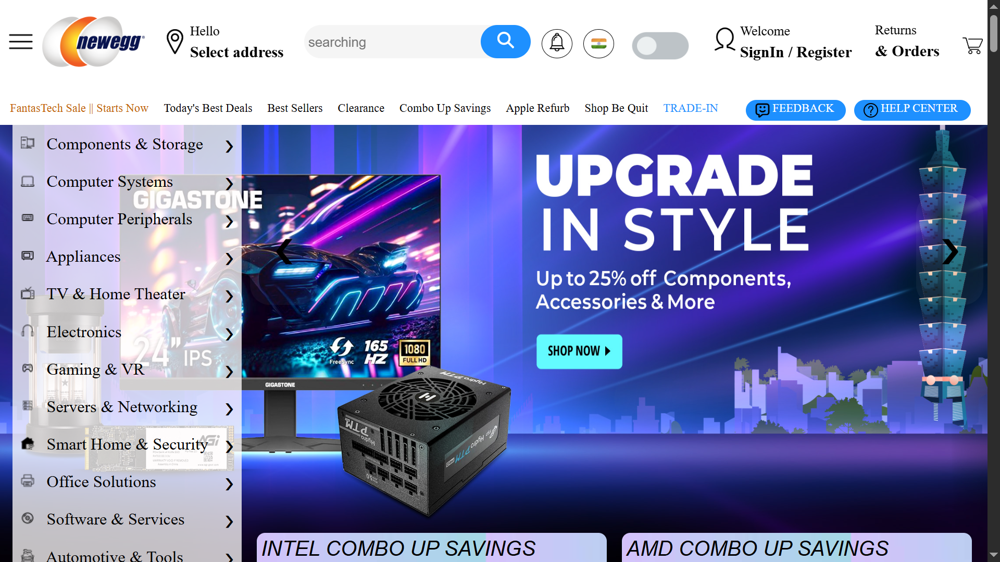

# 💻 Neweggs Electronics – PC Build E-Commerce Platform



**Neweggs Electronics** is a sleek and responsive front-end e-commerce platform inspired by Newegg, focusing exclusively on PC builds and related electronic components. Built with HTML, CSS, and JavaScript for a fully static, fast-loading experience.

---

## 🌐 Live Preview

👉 [Visit Neweggs Electronics](https://ragav7775.github.io/E-commerce-website/)

---

## ⚙️ Tech Stack

- HTML5
- CSS3
- JavaScript (Vanilla)
- FontAwesome (icons)

---

## 🚀 Features

- 🖥️ Product showcase for PC components (GPU, CPU, RAM, etc.)
- 💳 Simulated add-to-cart and product detail views
- 📱 Fully responsive layout optimized for desktop and mobile
- ⚡ Lightweight, no framework — fast loading experience

---

## 📦 Setup Instructions

```bash
# Clone the repository
git clone https://github.com/Ragav7775/E-commerce-website.git
cd neweggs-electronics

# Open index.html in your browser
```
---

Let me know if you’d like a version with product card previews or sample product data in JSON for a future dynamic upgrade.
